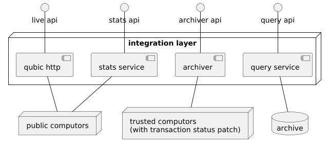

# Qubic Partner Integration

This documentation describes the best practices to integrate and interact with Qubic.

## Table of Contents

- [Qubic RPC](#qubic-rpc)
- [Exchange Integration](#exchange-integration)
- [RPC APIs Migration](#rpc-apis-migration)
- [Legacy Documentation](#legacy-documentation)

## Qubic RPC

The Qubic RPC API is the main way to interact with Qubic. It offers endpoints for querying blockchain data, submitting transactions, and interacting with smart contracts.

> Public API host: `https://rpc.qubic.org`

> [!TIP]
> We offer our public API for easy onboarding. However, partners can also run their own nodes and RPC infrastructure, if preferred.

The simplified architecture diagram below shows the available APIs and their relationship to the Qubic network:

| API          | Purpose                                 | Base Path    | Status              |
| ------------ | --------------------------------------- | ------------ | ------------------- |
| Query API    | Querying archived data                  | `/query/v1`  | ✅ Active            |
| Live API     | Querying live data from Qubic nodes     | `/live/v1`   | ✅ Active            |
| Archiver API | Legacy API for archived data            | `/v1`, `/v2` | ⚠️ Deprecated        |
| Stats API    | Market data, rich lists, and statistics | —            | 🔄 Subject to change |

> [!NOTE]
> - For partner integration, use the **Query API** and **Live API** only.
> - The Stats API is available but may introduce breaking changes without notice.

For API specifications, see the [Openapi Documentation](https://qubic.github.io/integration/Partners/swagger/qubic-rpc-doc.html).

## Exchange Integration

When integrating Qubic into your business logic, we recommend you use a TX based workflow.  
You may already be familiar with this approach from other blockchains. It mainly consists of performing block scans for deposits 
and sending transactions via an API call to the RPC infrastructure.

> [Read more about the TX based workflow](tx-based-workflow.md)

## RPC APIs Migration

> [!CAUTION]
> The Archiver API is deprecated and will be fully removed by 2026. If you are using it, migrate to the new Query API now.

See the [Migration Guide](migration.md) for deprecation timelines and replacement endpoints.

## Legacy Documentation

For previous integration guides (partners, exchanges, integrators), see [here](old/README.md).
