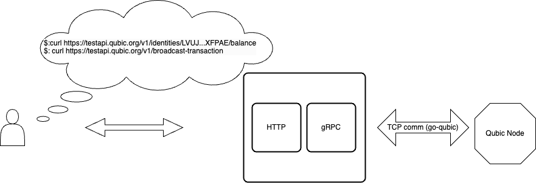

# Our mission

Our mission, as the Integration Team, is to create and develop software solutions which allow end users (such as individual and exchanges) to easily interact with the Qubic network.

Some of our current projects, include:
- The "Archiver" service - Historical information storage
- The HTTP API - Live interaction with the Qubic network
- The Stats service - General chain information and Rich-List
- The "Nodes" service - Utility service that maintains a list of reliable Qubic nodes
- The Node Connector library - Allows for communication with the Qubic nodes
- The GO SchnorrQ library - Qubic specific FourQ cryptographic signature creation and verification

# The archiver service: go-archiver

As we have seen before, the Tick and Transaction history is discarded during an Epoch change. Thus we have created the Archiver.
This service continuously requests information from the network, and it saves it to a database. The data can then be queried using both GRPC and HTTP.

## An architecture overview

Archiver is mainly composed of three parts:

### The processor
The processor is responsible for fetching data from a list of nodes.
Initially it will establish a connection to a node from a reliable node pool. Information will then be fetched, validated and store to the database.
### The Database
The database used in archiver is PebbleDB. This is a key-value based on LevelDB/RocksDB, with a high focus on performance.
### The API
Archiver exposes both an GRPC and HTTP API, which can be used to query the information in the database.

## The validation process
Before any information is saved to the database, it must be photographically validated
### Computor list validation
1. The Arbitrator public key is obtained from it's Identity.
2. A digest is obtained by performing the K12 hashing function on the epoch and computor Identity list in binary form.
3. Using the arbitrator public key and computor signature, we perform a SchnorrQ signature verification on the digest.
4. If signature verification is true, then the computor list if valid.
### Quorum votes validation
1. A check is performed to ensure that there are at least 451 votes on the quorum.
2. We obtain the digest of every vote. The digests are used to create a "heatmap", which allows for obtaining the "aligned votes" (the majority).
3. A second check is performed to verify that there are at least 451 aligned votes.
4. The aligned votes then go through signature verification to ensure they have been signed by their computor.
5. If all aligned votes pass signature verification, then the votes are valid.
### Tick data validation
1. First, we check if the tick data and the vote digest are empty. If they both are, no further verification is needed.
2. The public key of the computor specified by the tick data is obtained.
3. Then we obtain the digest of the tick data by performing the K12 hashing function on it, without including the signature.
4. Using the public key, signature verification is used to ensure that the tick signature matches the digest.
5. Another digest is obtained by hashing the full tick data.
6. This digest is verified against the digest from a quorum vote.
### Transaction validation
1. A "digest map" is created from the list of transaction digest in the tick data.
2. if map is empty no further validation is necessary.
3. If the length of the map does not match the number of transactions, the transactions cannot be validated.
4. For every transaction, we obtain the transaction digest and the transaction ID.
5. A check is performed to verify that the transaction digest exists in the digest map.
6. Another digest is created by performing the K12 hashing function on the transaction data, excluding the signature.
7. This digest then goes through cryptographic signature verification, using the sender's public key and the transaction signature.
8. If any of the transactions cannot be verified, then the transactions cannot be validated.

# The live api: qubic-http

## An architecture overview

The HTTP API acts as a bridge to the Qubic network. Some of it's features include:
- Balance checking
- Transaction broadcasting
- Tick information
- Block height
- Identity assets
    - Issued
    - Owned
    - Possessed
      The difference between the HTTP API and the Archiver is that the HTTP API does not perform any information storage, it only feeds live information from the network.
## How does it work
The service requires the "Nodes Service" as a dependency, in order to maintain a list of reliable node connections.
In the event of a web request, the service connects to one of the nodes in the node pool, and requests the information needed by the user.
## Why have this service
In order to communicate with the Qubic network, one needs to use the custom packet based communication protocol. This is achieved using the "Node Connector" library, which we will talk about later. We aim to provide the end user with an easy way to communicate with the network, without them needing to understand the underlying networking.
# The Stats Service
The Stats Service is responsible for scraping, calculating, saving and exposing general information related to the the network.
Some of the information includes:
- Circulating supply
- Nr. of active addresses
- Coin price in USD
- Market cap
- The current epoch
- Count of empty ticks in current epoch
- Epoch tick quality
- Number of burned QUs
- Rich list

